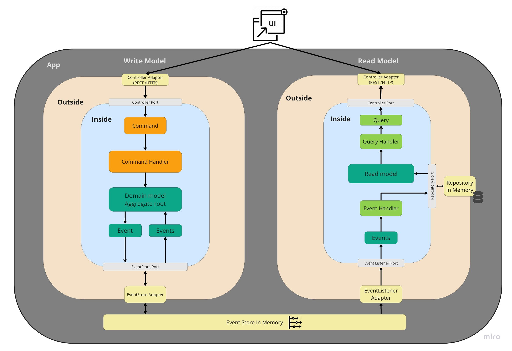

# Burraco Card game
  

  

## Todo List
Game context:
- [x] Implement Burraco game command model
- [ ] Implement Burraco game read model
- [ ] Implement Burraco game API

Score Board context:
- [ ] Implement Score Board context
- [ ] Implement Score Board context API

Player context:
- [ ] Implement Players context
- [ ] Implement Players context API

Clients
- [ ] Implement Web client
- [ ] Implement Mobile client

## Architecture
Based on:
* [CQRS - Command Query Responsibility Segregation](https://martinfowler.com/bliki/CQRS.html)

* [Hexagonal_architecture](https://en.wikipedia.org/wiki/Hexagonal_architecture_(software))
* [Domain Driven Design](https://martinfowler.com/tags/domain%20driven%20design.html)

